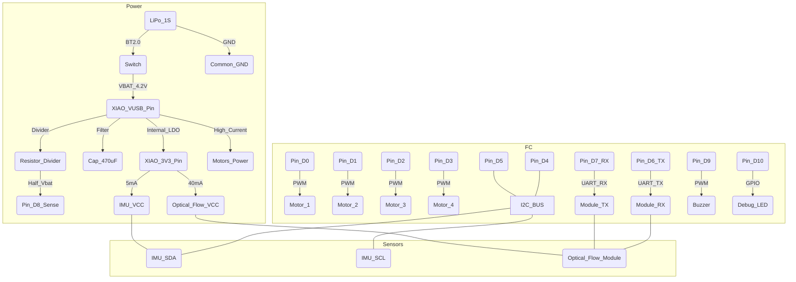

# Diagramma Hardware: ESP32-S3 Aero-Edu Swarm (Definitivo UART)

Questo diagramma riflette l'uso del modulo integrato Optical Flow + ToF via UART e il monitoraggio batteria.

## PINOUT Finale XIAO ESP32S3
1.  **D0, D1, D2, D3:** Motori (PWM)
2.  **D4, D5:** Bus I2C (IMU - GY-521)
3.  **D6, D7:** Bus UART1 (Flow/ToF - Matek 3901-L0X)
4.  **D8 (A8):** V-Sense (Analog Read Batteria)
5.  **D9:** Buzzer (Audio Feedback)
6.  **D10:** LED status (singolo colore) via R 330Ω.
7.  **3V3 (Output):** Alimentazione SENSORI (IMU + Flow). **Max 200mA.** (Carico attuale: ~45mA).
8.  **VUSB (Input):** Ingresso alimentazione da Batteria 1S (via Switch). **NON collegare USB e batteria contemporaneamente.** **NON COLLEGARE SENSORI QUI.**
9.  **GND:** Massa comune.
