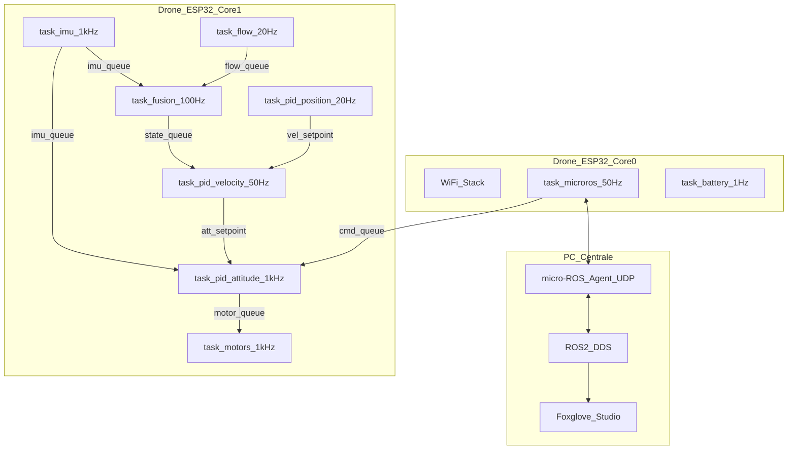

# ESP32-S3 Aero-Edu Drone: Project Context & Architecture

**Last Updated:** March 10, 2026
**Author:** Angelo (User), Gemini (Agent), Claude (Agent)

## 1. Visione e Obiettivi
Piattaforma drone didattica low-cost basata su ESP32-S3 per lo studio di sistemi distribuiti e controllo.
Sciame di micro-droni coordinati via WiFi (LAN comune), con PC centrale per visualizzazione (Foxglove Studio) e invio comandi.

---

## 2. Architettura di Sistema

**Framework:** ESP-IDF + FreeRTOS + micro-ROS (migrazione da Arduino completata nel design del 2026-03-10).
**Spec completa:** `docs/specs/2026-03-10-swarm-drone-architecture-design.md`

### High-Level Overview

### Suddivisione Compiti (Dual Core)
*   **Core 1 (Flight):** task_imu (1kHz), task_flow (~20Hz), task_pid_attitude (1kHz), task_motors (1kHz), task_fusion (100Hz, Fase 2+), task_pid_velocity (50Hz, Fase 2), task_pid_position (20Hz, Fase 3).
*   **Core 0 (Comms):** WiFi stack (ESP-IDF default), task_microros (50Hz), task_battery (1Hz).
*   **Motivazione:** WiFi stack ESP-IDF e pinned a Core 0 di default. Flight control su Core 1 non compete con i task di rete.

### Allocazione Pin (XIAO ESP32-S3) - DEFINITIVA
| Pin XIAO | Funzione | Bus | Note |
| :--- | :--- | :--- | :--- |
| **D0** | Motore 1 (FL) | PWM | |
| **D1** | Motore 2 (FR) | PWM | |
| **D2** | Motore 3 (BL) | PWM | |
| **D3** | Motore 4 (BR) | PWM | |
| **D4** | SDA | I2C | IMU (MPU6050) |
| **D5** | SCL | I2C | IMU (MPU6050) |
| **D6** | TX1 | UART | Optical Flow + ToF |
| **D7** | RX1 | UART | Optical Flow + ToF |
| **D8** | V-Sense | Analog | Partitore Batteria |
| **D9** | Buzzer | PWM | Alert sonori |
| **D10** | Status LED | GPIO | Debug visivo |

---

## 3. Strategia Meccanica & Pesi
*   **Telaio:** 75mm Whoop (Plastica).
*   **Propulsione:** 8520 Brushed Coreless.
*   **Target Peso:** < 65g (TWR > 2.5:1).

## 4. Power & Monitoring
*   **Alimentazione:** 1S LiPo (BT2.0 connector).
*   **Tethering:** Buck Converter regolato a 4.2V per test al banco.
*   **V-Sense:** Partitore resistivo 100k/100k su pin D8 per monitoraggio tensione cella.

## 5. Roadmap di Sviluppo

| Fase | Obiettivo | Prerequisiti |
|---|---|---|
| **0A** | Architettura ESP-IDF + sensori raw su Foxglove | Hardware attuale |
| **0B** | Test motori (PWM da Foxglove/CLI) | Motori + MOSFET saldati |
| **1** | Stabilizzazione attitudine (PID, hover) | Fase 0B + tuning |
| **2** | Velocity hold (optical flow in volo) | Fase 1 + validazione flow |
| **3** | Position control (comandi posizione dal PC) | Fase 2 |

Dettagli completi nella spec: `docs/specs/2026-03-10-swarm-drone-architecture-design.md`

## 6. Espansioni Future
*   **I2C Multiplexing:** TCA9548A per aggiungere sensori con indirizzi identici.
*   **Percezione Spaziale:** Sensore VL53L5CX (8x8 zone) per obstacle avoidance.
*   **Magnetometro:** QMC5883L per yaw assoluto (risolve drift gyro).
*   **OTA Updates:** Aggiornamento firmware via WiFi.